# How to Use Github

## Create Task

Create a task from Project Backlog Panel

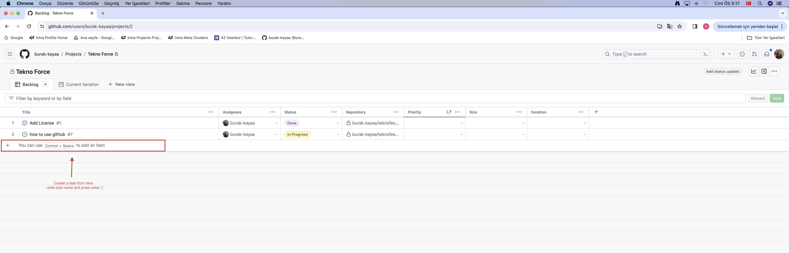

## Edit Task

You can edit task features from here, if you want to link it with repo you can doit like this:

> Do not forget: if you do not add or update a file on github repo, do not link it to repo.

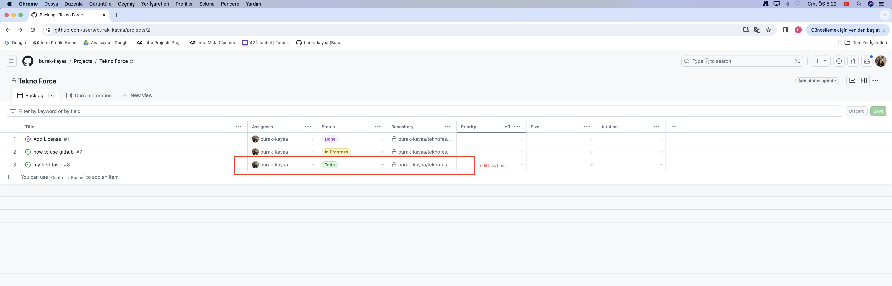

## Go to Issue

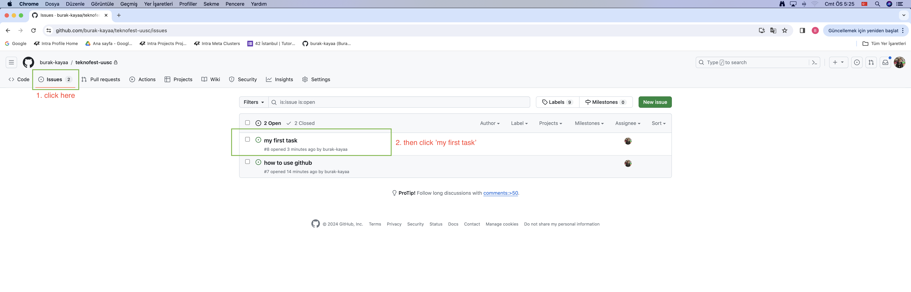

## Create a Branch from Issue

You can create a branch from issue like this:

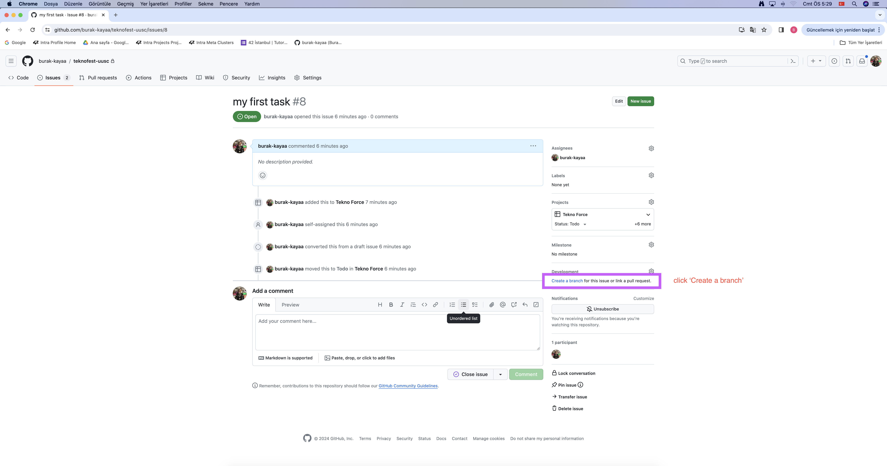

then:

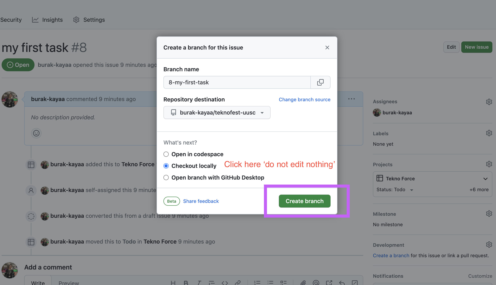

and:

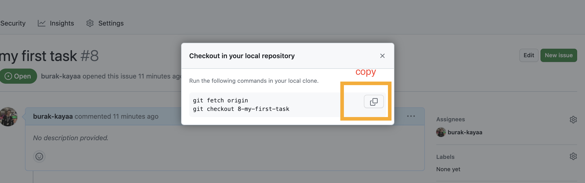

## Do Your Work

Now you can copy that command to console, and then you can free to do your work.

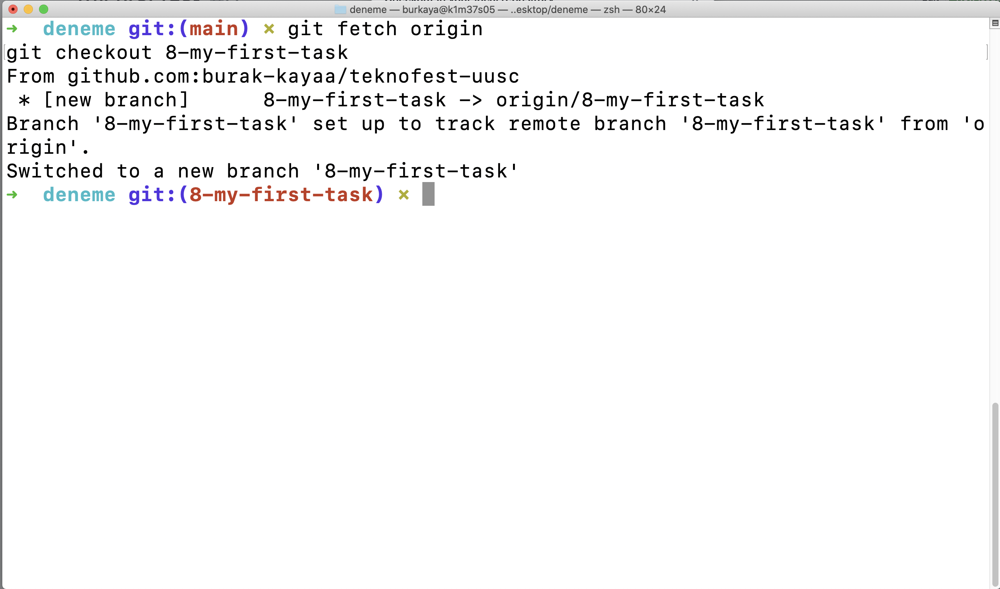

then when your work finneshed, you can push then to github like this:

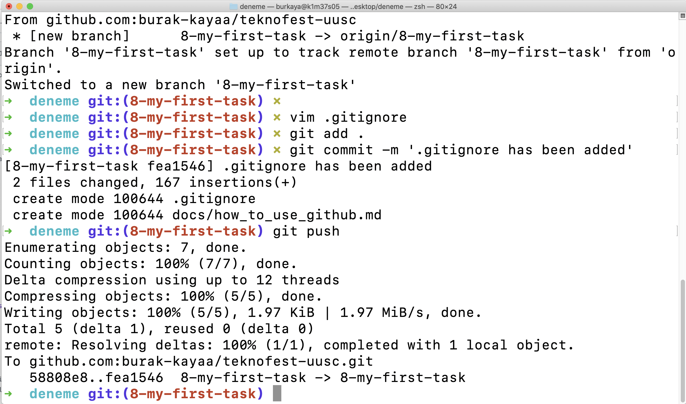

## Create Pull Request

Now you need to create a pull request, so click compare and pull request button below:

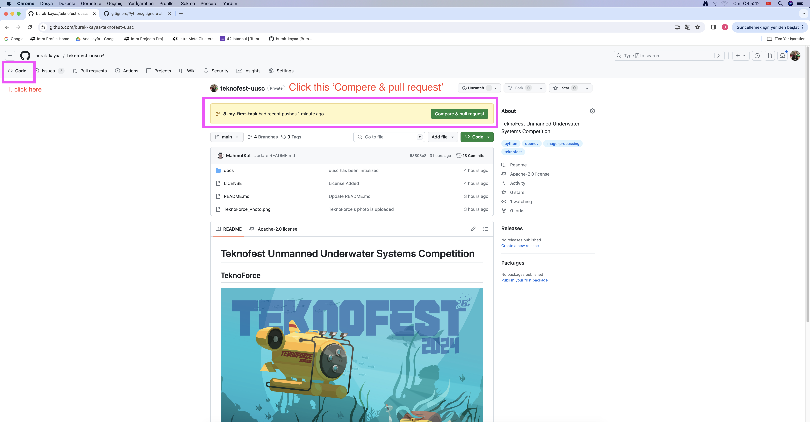

then, create pull request:

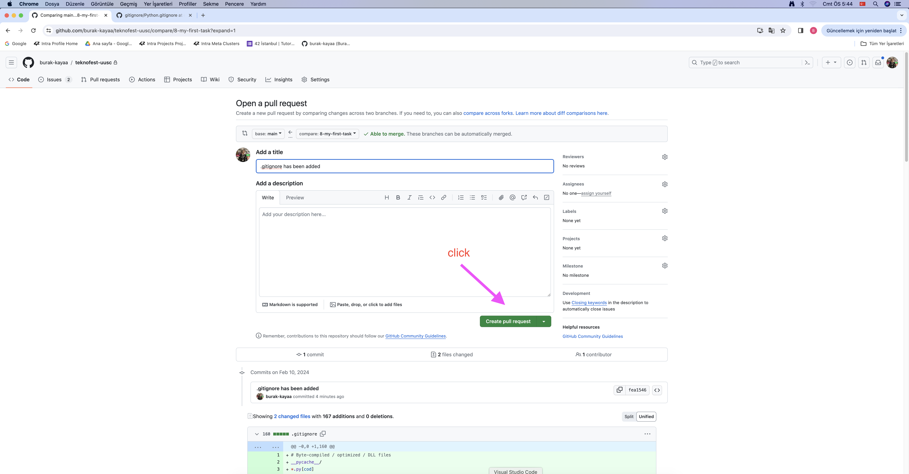

then, merge it to main branch:

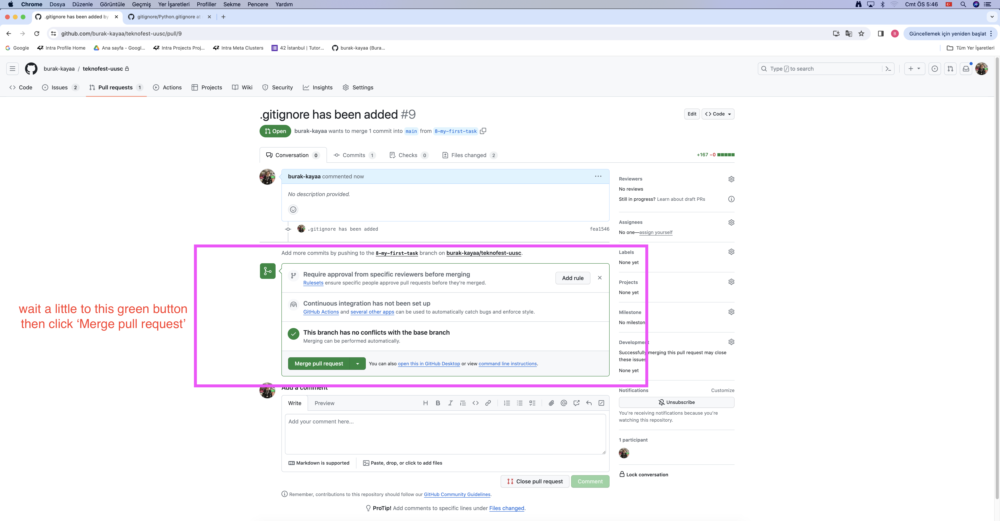

then, confirm merge:

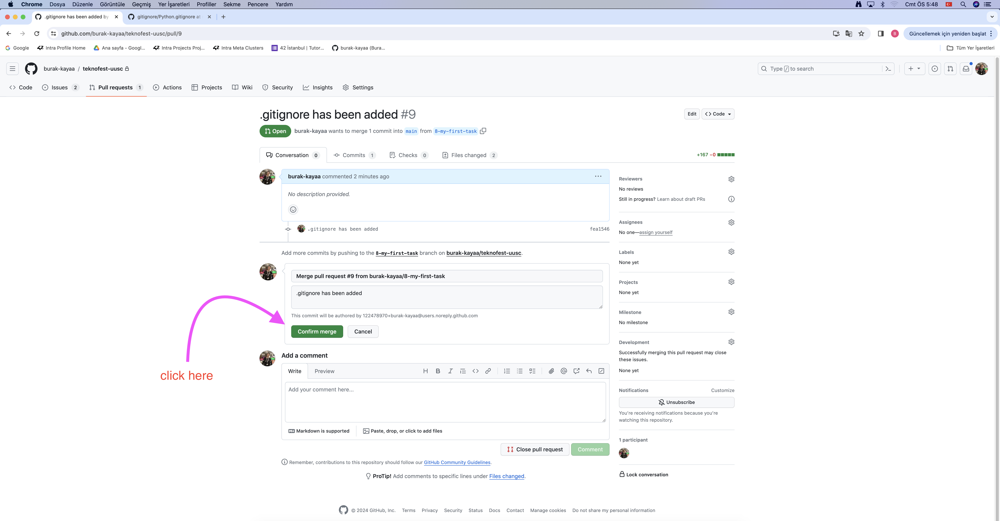

then, do not forget to delete old branch:

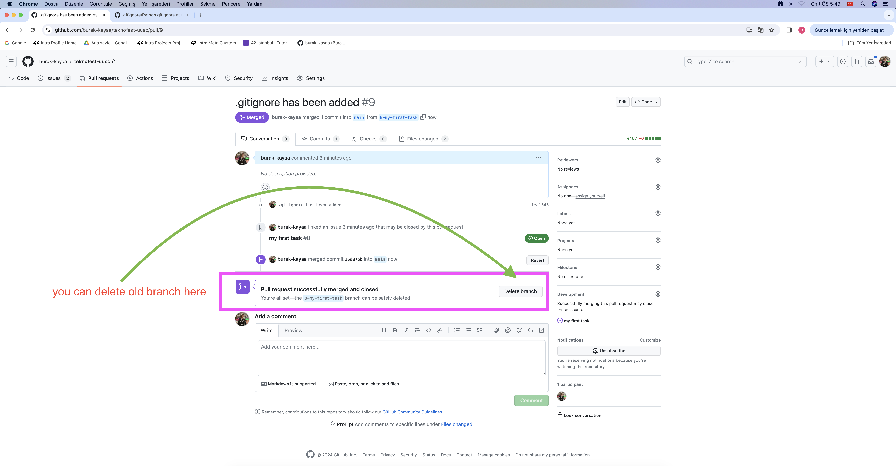

if you forgot it to delete, you can delete it later from 'view all branches' part of the branches widget.
